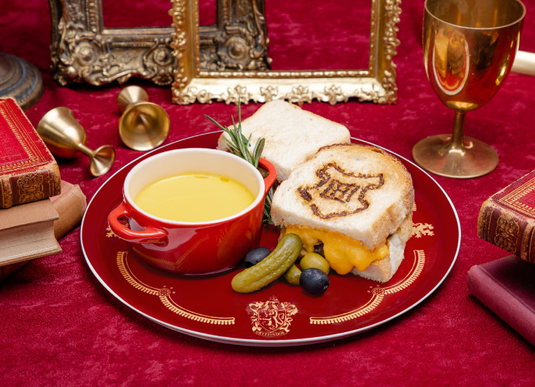
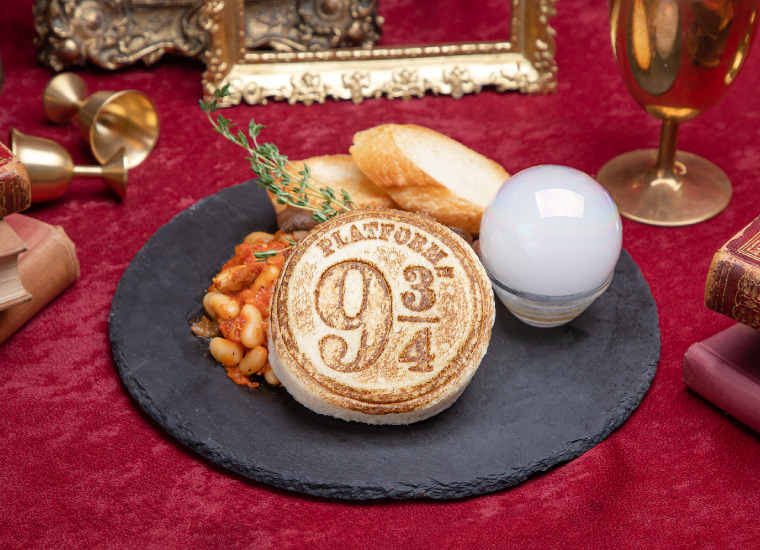
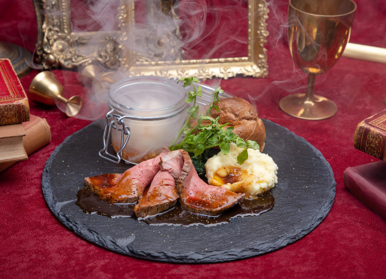
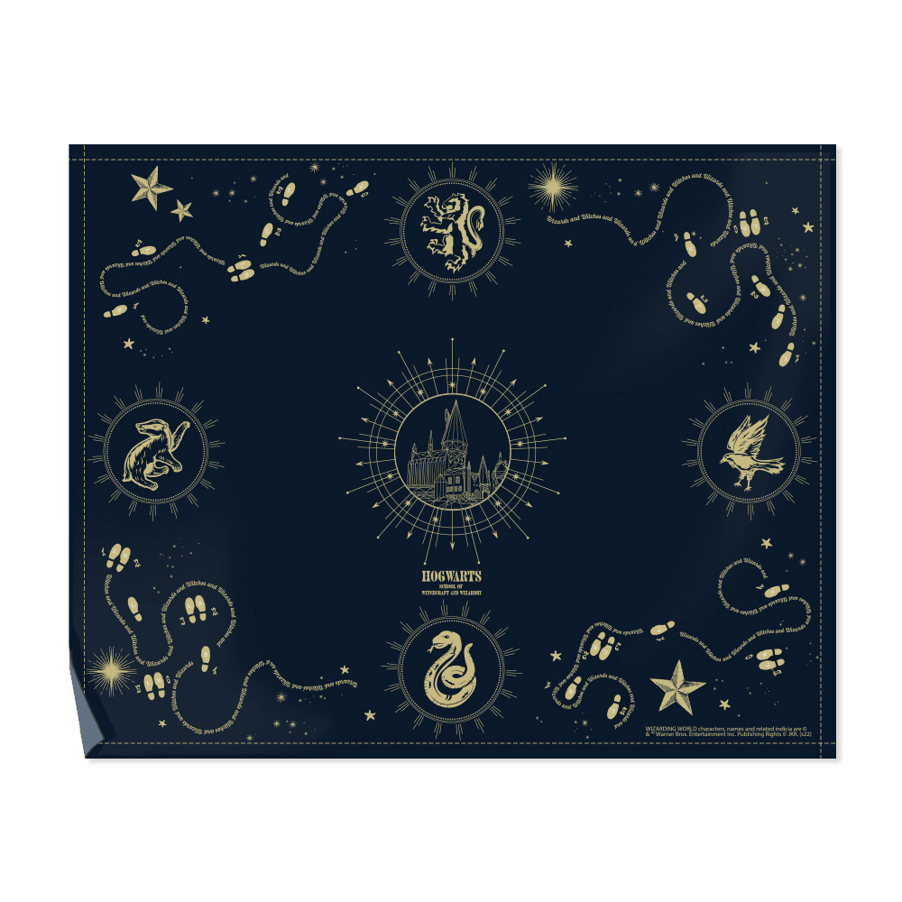

# 20230303

## 1. 羽田空港→ハリーポッターカフェ

- メイン候補([link](https://goo.gl/maps/4t7PpTGkATLEzxaS6))

| 概要                                |   時間    | お金  |                    時刻表                     | 支払い | 乗車位置 |
| :---------------------------------- | :-------: | :---: | :-------------------------------------------: | :----- | :----- |
| 羽田空港第１・第２ターミナル駅→新橋駅 (空港線　快特青砥行)       | 12:03-12:28 |  461  |                 [link](https://onl.bz/msgFQ7r)                  | suica  | 1・2番線
| 新橋駅→赤坂見附駅 (銀座線　各停渋谷行) | 12:34-12:39 |   168   | [link](https://onl.bz/D433HA7) | suica      | 1番線 |
| 赤坂見附駅→ハリーポッターカフェ (徒歩) | 12:39-12:55 |   -   | - | -      |

## 2. ハリーポッターカフェ(Map[Link](https://goo.gl/maps/b1dLDmB6MQA32pQo9))

- 13:00-14:30まで滞在予定
- [公式サイト](https://hpcafe.jp/)

### メニュー

- [Cafe Menu](https://hpcafe.jp/menu/#unq_01)
- [Side Dishes](https://hpcafe.jp/menu/#unq_02)
- [Main Dishes](https://hpcafe.jp/menu/#unq_03)
- [Dessert](https://hpcafe.jp/menu/#unq_04)
- [Non-alcoholic Cocktails](https://hpcafe.jp/menu/#unq_05)

### 気になるメニュー

- ホグワーツ チーズトースティーグリフィンドール ～ ビーフ＆オニオン ～
  - ¥1,600(税込¥1,760)
    
- サーモンタルタル with ゴールデン・スニッチ
  - ¥1,000(税込¥1,100)
    
- 9と3/4番線 ビーンズ
  - ¥1,000(税込¥1,100)
    
- ドラゴンの吐息 ローストビーフ
  - ¥2,350(税込¥2,585)
    
- ヘドウィグ ケーキ
  - ¥1,400(税込¥1,540)
    
- エクスペクト・パトローナム
  - ¥1,200(税込¥1,320)
    

### 事前予約がお済みのお客様

事前予約された時間帯の開始時刻10分前からカフェ入口にて受付を開始いたします。
ご予約時間から連絡なく15分以上経過した場合、ご予約をキャンセルとさせていただきます。

### グッズ

- カフェご利用のお客様とテイクアウトご利用のお客様に限らせていただきます。

#### 気になるグッズ

- ランチョンマット
  - ¥1,450(税込¥1,595)
    
- ランチバッグ
  - ¥1,600(税込¥1,760)
    
