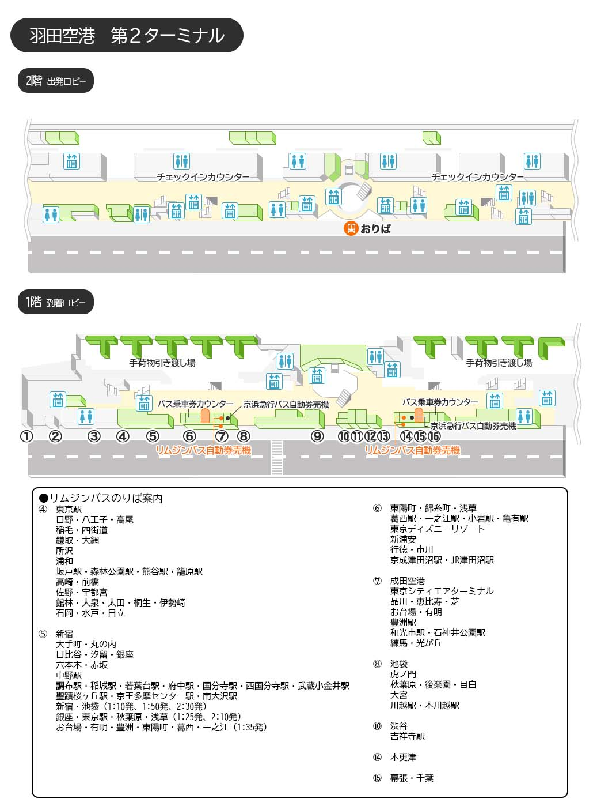

# 0303

## 1. 麻布箪笥町 天涼庵→羽田空港

- 六本木一丁目駅→羽田空港第１・第２ターミナル駅(21:30-22:18)

| 概要                                |   時間    | お金  |                    時刻表                     | 支払い | 乗車位置 |
| :---------------------------------- | :-------: | :---: | :-------------------------------------------: | :----- | :----- |
| 六本木一丁目駅→白金高輪駅 (南北線各停白金高輪行)       | 21:30-21:34 |  168  |                 [link](https://onl.bz/aPt7Dpg)                  | suica  | 2番線
| 白金高輪駅→三田駅 (地下鉄三田線各停西高島平行) | 21:41-21:44 |   178   | [link](https://onl.bz/BVLkD96) | suica      | 1番線 |
| 三田駅→羽田空港第１・第２ターミナル駅 (浅草線急行羽田空港第１・第２ターミナル行) | 21:50-22:18 |   461   | [link](https://onl.bz/LkJx3rT) | suica      | 1番線 |

- コインロッカーからキャリーなどを取り出す

## 2. 羽田空港→海浜幕張駅

- リムジンバス羽田空港線
- 22:50-23:27
- 1人1200円
- [時刻表](https://www.limousinebus.co.jp/guide/timetable/suspension2023_h_0301.pdf)
  - 他の時間
    - 23:30-0:04(最終)
    - 22:20-22:57
- 予約なしのため、少し不安
- 乗り場画像の⑮

## ホテル

- 23:30チェックイン
- ホテルシュランザＭＡＫＵＨＡＲＩ　ＢＡＹ
- カード決済済
- 宿泊施設電話番号
  - 0433074441
- スーペリアダブル【17平米/ベッド幅160cm】(spd)
- 1Fにローソンあり
- 屋上に大浴場あり
