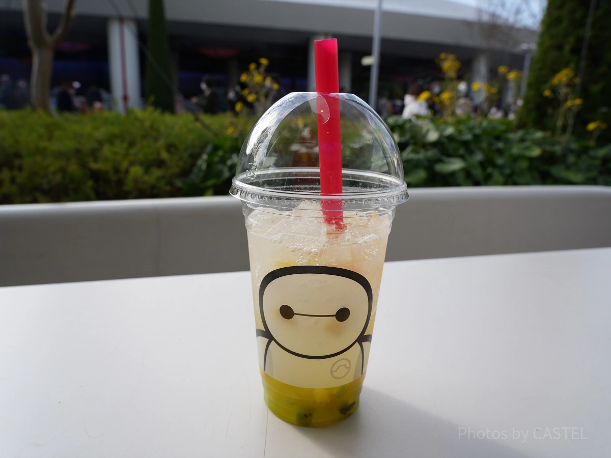

# 0304

## 東京ディズニーシー

- チケット購入共有済

## レストラン櫻

- 15:30- 予約済み

## 営業時間

- 9:00 - 21:00

## 天気予報

- 曇り時々晴れ

- 14℃|6℃
- 降水確率 30%

## 当日のショースケジュール

- [ディズニー・ライト・ザ・ナイト](https://www.tokyodisneyresort.jp/tds/show/detail/930/)
  - 20:40～
- [ミニー、ウィー・ラブ・ユー！](https://www.tokyodisneyresort.jp/tds/show/detail/978/)
  - 12:00 / 16:00
- [ジャンボリミッキー！レッツ・ダンス！](https://www.tokyodisneyresort.jp/tds/show/detail/986/)
  - エントリー受付
  - 11:05 / 12:20 / 13:45 / 15:35 / 16:50
- [ビリーヴ！～シー・オブ・ドリームス～](https://www.tokyodisneyresort.jp/tds/show/detail/967/)
  - 19:40
  - エントリー受付

## 休止アトラクション

- フォートレス・エクスプロレーション
- タートルトーク
- マーメイドラグーンシアター

## ディズニー・プレミアアクセス

- [公式サイト](https://www.tokyodisneyresort.jp/tds/guide/disneypremieraccess.html)
- パーク内施設等の体験時間や入場時刻を指定して予約できる有料のサービス
- 対象アトラクション
  - センター・オブ・ジ・アース
    - 1,500円/回
  - トイストーリーマニア
    - 2,000円/回
  - タワーオブテラー
    - 1,500円/回
  - ソアリン
    - 2,000円/回

## 乗りたいアトラクション

- ヴェネツィアン・ゴンドラ
  - 9:00-18:10
  - 営業時間の終わりが早いため、早めに並ぶ
- トイ・ストーリー・マニア
  - 最初並ぶ
- アトラクションのスタンバイパスはないみたい・・・
- トイマニとソアリンはプレミアアクセス使いたい

## 飲みたいドリンク

- スパークリングゼリーティー（マスカット＆キウイ）
  - トゥモローランド・テラス
    
- ディズニーシーお酒MAP
  

## ホテルへは電車で帰宅

- リゾートラインで舞浜駅へ
- 舞浜駅から海浜幕張駅
